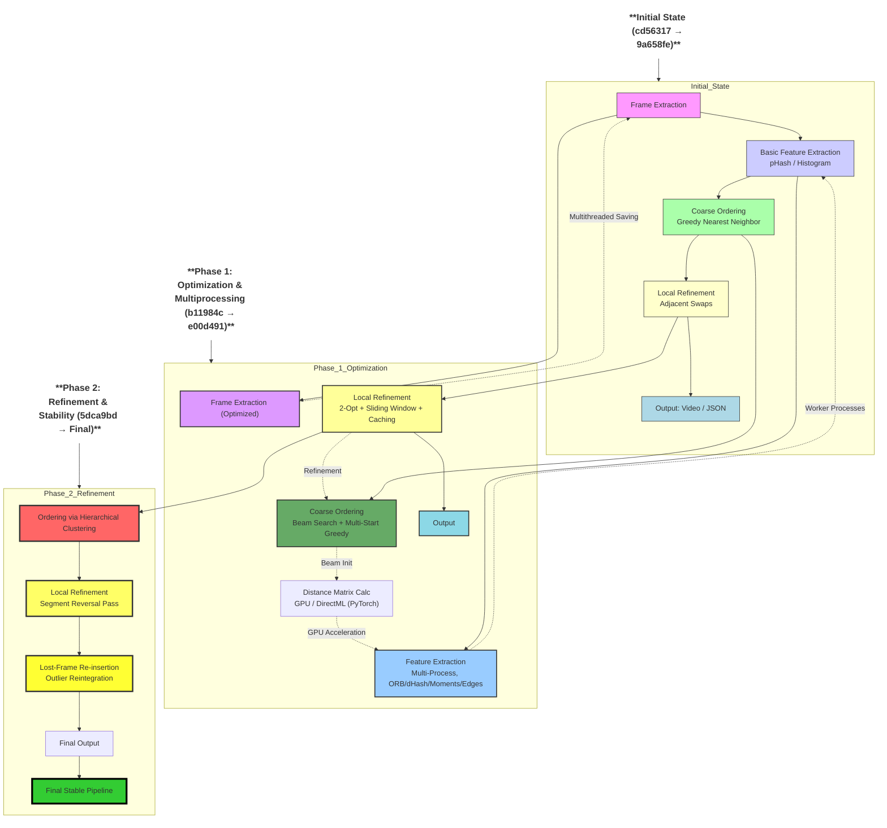

# Frame Restoration

This project reconstructs the correct order of frames from a jumbled video.

## 1. Source Code

### Installation

1.  **Set up Python Environment:**
    This project requires **Python 3.11.9**. It is highly recommended to use this version for optimal compatibility, especially with `torch-directml` for GPU acceleration on Windows. Newer Python versions may not have stable support for `torch-directml`.

2.  **Clone the repository:**
    ```bash
    git clone https://github.com/your-username/frame-restoration.git
    cd frame-restoration
    ```

3.  **Create a virtual environment (recommended):**
    Ensure you are using your Python 3.11.9 interpreter.
    ```bash
    python -m venv .venv
    source .venv/bin/activate  # On Windows, use `.venv\Scripts\activate`
    ```

4.  **Install dependencies:**
    ```bash
    pip install opencv-python numpy Pillow imagehash scikit-learn tqdm torch
    ```
    **For integrated GPU acceleration on Windows with AMD/Intel CPUs, install `torch-directml`:**
    ```bash
    pip install torch-directml
    ```

### How to Run

The main script `main.py` runs the entire pipeline.

1.  **Place your jumbled video file** in the root of the project directory. Let's assume the video is named `jumbled_video.mp4`.

2.  **Run the pipeline:**
    ```bash
    python main.py jumbled_video.mp4
    ```

    This will:
    *   Extract frames into the `frames/jumbled_video/` directory.
    *   Extract features from the frames and save them to `features/jumbled_video_features.npy`.
    *   Compute the correct frame order.
    *   Save the reordered frame sequence to `output/jumbled_video_order.json`.
    *   Reconstruct the video and save it as `output/reconstructed_video.mp4`.

### Optimal Parameters

For better accuracy, you can use the following parameters. These parameters increase the search space and iterations, which may result in longer processing time.

```bash
python main.py jumbled_video.mp4 --beam_width 7 --starts 10 --two_opt_iter 100 --window_size 5 --swap_iter 5 --force-original-resolution
```

## 2. Algorithm Explanation

### Pipeline Flowchart

Here is a high-level overview of the frame restoration pipeline:


### Approach and Techniques

The frame reordering process is treated as a variation of the Traveling Salesperson Problem (TSP), where each frame is a "city" and the "distance" between them is a measure of their dissimilarity. The goal is to find the shortest path that visits every frame exactly once, which corresponds to the most logical sequence.

The algorithm uses a multi-stage approach to solve this problem:

1.  **Feature Extraction:** For each frame, a rich set of features is extracted to capture its visual content. These features include:
    *   **ORB Descriptors:** For identifying keypoints and their characteristics.
    *   **Color Histograms (HSV):** To represent the color distribution.
    *   **Perceptual Hashes (pHash, dHash):** For fast and robust image similarity comparison.
    *   **Edge Density Histograms:** To capture structural information.
    *   **Color Moments:** To represent the color distribution in a more compact way.

2.  **Distance Matrix Calculation:** A weighted distance matrix is computed between all pairs of frames. The distance is a combination of the distances calculated from each of the features mentioned above. This provides a comprehensive measure of similarity between frames.

3.  **Initial Ordering:**
    *   **Beam Search:** A beam search algorithm is used to find a good initial ordering of the frames. This is more robust than a simple greedy approach.
    *   **Hierarchical Clustering:** For very long videos, a hierarchical clustering approach is used to group similar frames together first, then sort the clusters, and finally sort the frames within each cluster.

4.  **Refinement:** The initial order is then refined using several local search techniques:
    *   **2-Opt Refinement:** A classic TSP heuristic that iteratively improves the path by reversing segments.
    *   **Sliding Window Refinement:** The order is further refined by optimizing small, overlapping windows of frames.
    *   **Adjacent Swap Refinement:**  A final pass is made to swap adjacent frames if it improves the local sequence.
    *   **Segment Reversal Refinement:**  This pass checks for and reverses small, backward sequences.
    *   **"Lost and Found" Re-insertion:**  This step identifies frames that are poorly placed in the sequence and re-inserts them in a better location.

### Design Considerations

*   **Accuracy:** The multi-feature approach and the multi-stage refinement process are designed to maximize the accuracy of the final ordering.
*   **Time Complexity:** The use of hierarchical clustering and beam search helps to manage the time complexity for large numbers of frames. The refinement steps are local and have a lower time complexity than a global search.
*   **Parallelism:** The feature extraction and some of the refinement steps are parallelized to take advantage of multi-core processors and speed up the process.
*   **GPU Acceleration:** The distance matrix calculations are accelerated using the integrated GPU (iGPU) that comes with most modern CPUs (via `torch-directml`). This provides a significant speed-up on many laptops and desktops without requiring a dedicated graphics card.

## 3. Execution Time Log

The execution time of the pipeline is logged to the console at the end of the run. A summary of the pipeline's performance is also saved to `output/pipeline_summary.json`.

Example output:
```
[i] DirectML device found. Using integrated GPU for acceleration.

============================================================
FRAME REORDERING PIPELINE - jumbled_video
============================================================

[1/7] Extracting frames...
      ✓ Extracted 300 frames in 3.59s

[2/7] Extracting features (ORB + HSV + hashes + edges + moments)...
[i] Extracting features for 300 frames using 16 workers...
[i] Forcing original resolution as requested.
[i] DirectML device found. Using integrated GPU for acceleration.
[i] DirectML device found. Using integrated GPU for acceleration.
[i] DirectML device found. Using integrated GPU for acceleration.
[i] DirectML device found. Using integrated GPU for acceleration.
[i] DirectML device found. Using integrated GPU for acceleration.
[i] DirectML device found. Using integrated GPU for acceleration.
[i] DirectML device found. Using integrated GPU for acceleration.
[i] DirectML device found. Using integrated GPU for acceleration.
[i] DirectML device found. Using integrated GPU for acceleration.
[i] DirectML device found. Using integrated GPU for acceleration.
[i] DirectML device found. Using integrated GPU for acceleration.
[i] DirectML device found. Using integrated GPU for acceleration.
[i] DirectML device found. Using integrated GPU for acceleration.
[i] DirectML device found. Using integrated GPU for acceleration.
[i] DirectML device found. Using integrated GPU for acceleration.
[i] DirectML device found. Using integrated GPU for acceleration.
[i] Processed 50/300 frames (16.7%)
[i] Processed 100/300 frames (33.3%)
[i] Processed 150/300 frames (50.0%)
[i] Processed 200/300 frames (66.7%)
[i] Processed 250/300 frames (83.3%)
[i] Processed 300/300 frames (100.0%)
[+] Features saved to features\jumbled_video_features.npy in 31.21s
[i] Processing speed: 9.6 frames/sec
      ✓ Features extracted in 31.21s

[3/7] Computing distance matrices...
      - ORB distances...
      - Histogram distances...
      - Perceptual hash distances...
      - Difference hash distances...
      - Edge histogram distances...
      - Color moment distances...
      - Combining distances...
      ✓ Distance matrices computed in 41.51s

[4/7] Initial ordering with beam search (width=7, starts=10)...
      ✓ Initial order found in 0.97s

[5/7] 2-opt refinement (max_iter=100)...
      ✓ 2-opt completed in 0.78s

[6/7] Local refinement with actual frames...
      - Sliding window optimization (window=5)...
      - Adjacent swap refinement (iter=5)...
      - Final sliding window pass (window=3)...
      ✓ Local refinement completed in 73.76s

[7/7] Saving results and reconstructing video...
      - Order saved: output\jumbled_video_order.json

Writing video: 100%|██████████████████████████████████████████████████████████████████████| 300/300 [00:10<00:00, 29.61it/s]
      - Video saved: output\reconstructed_video.mp4
      ✓ Output generation in 10.70s

[*] Evaluating results...
[i] Average frame-wise similarity: 99.28%

============================================================
PIPELINE COMPLETE
============================================================
Total runtime: 182.63s (3.04 min)
Average frame similarity: 99.28%
Output video: output\reconstructed_video.mp4
============================================================

Summary saved to: output/pipeline_summary.json
```

## 4. Code Evolution


